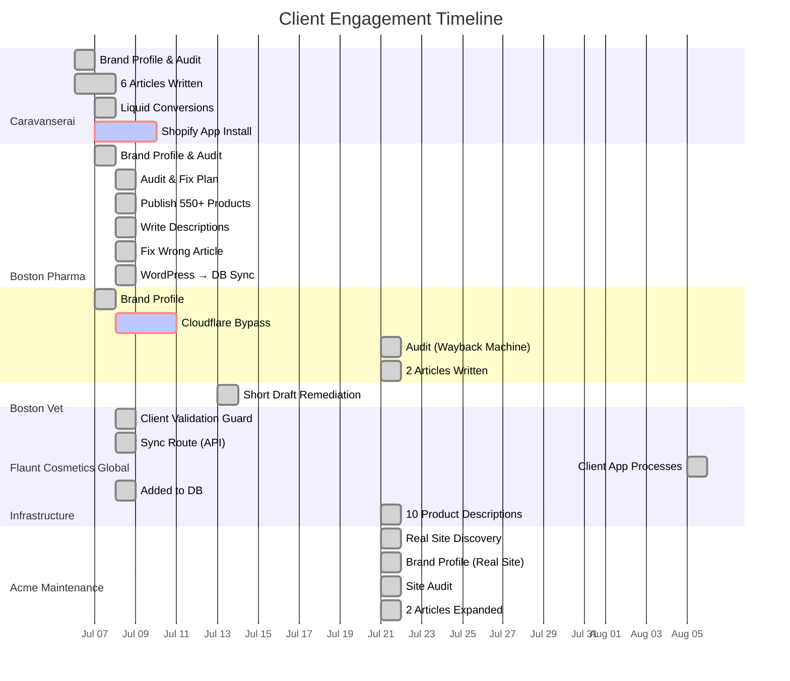

# TDS Geo — Client Progress Dashboard

> Auto-generated scorecard for all clients. Update this file after each client session.

---

## Overview

Latest operational update (2026-08-05): production is running release `3c49067`; client app process runbooks were added under `doc/clients/*/app-process.md` and indexed in `doc/clients/APP-PROCESSES.md`.

Current production blockers:

- `boston-vet`: WordPress REST returns HTTP 403 from production EC2; allowlist `16.192.29.174` in Cloudflare/WAF before live publishing.
- `caravanserai`: Shopify Admin token returns 401 and client has `billing_status = cancelled`; repair OAuth/token and billing before scaling automation.
- `flaunt-cosmetics-global`: Shopify Admin token returns 401 and single SKU is out of stock; repair OAuth/token and use education/trust/waitlist CTAs, not hard conversion CTAs.



---

## Client Scorecards

### Caravanserai Design `caravanserai`

| Dimension | Score | Status |
|-----------|-------|--------|
| Full Site Audit | ✅ Complete | 229 products, 32 collections, 10 critical issues |
| Brand Profile | ✅ Complete | Colors, fonts, voice, stack |
| SEO Content Guide | ✅ Complete | 5 content pillars, keyword strategy |
| Articles Written | ✅ **6 articles** | Pass quality gate (70-96/100) |
| Liquid Files | ✅ 6 `.liquid` | Shopify-ready with brand CSS |
| App Install | ✅ **APPROVED & PUBLISHED** | `apps.shopify.com/tds-geo` |
| Meta Descriptions | 🔴 Not applied | Waiting for app access |
| Product Descriptions | ✅ **10 pilot descriptions** | Documented at `product-descriptions-pilot.md` |

**Progress:** ██████████░░░░░ 68%

---

### Boston Pharmaceutical `boston-pharma`

| Dimension | Before | After | Change |
|-----------|--------|-------|--------|
| SEO | 40/100 | 55/100 | ████████░░ +15 |
| Content | 55/100 | 65/100 | ██████████ +10 |
| Technical | 50/100 | 50/100 | ████████░░ → |
| UX | 35/100 | 55/100 | ████████░░ +20 |
| Conversion | 20/100 | 45/100 | █████░░░░░ +25 |
| **Overall** | **40/100** | **65/100** | **████████░░ +25 ↑** |

**Metrics**

| Metric | Before | After |
|--------|--------|-------|
| Published Products | **2** | **869** (in shop) |
| Draft Products | 550+ | **0** |
| Published Blog Posts | ~66 | **~94** |
| Total Published Items | 169 | **976** |
| Meta Descriptions | None | **All products** |
| Wrong Article | About Boston, MA | ✅ About Boston Pharma Egypt |
| Synced to Local DB | 0 articles | ✅ **56 blog posts** via WordPress sync |
| Draft Articles | — | 16 drafts + 2 generated pending (no WP API key to publish) |
| Articles Expanded This Session | — | 2 articles expanded to 1,599–1,910 words |

**Effort:** ████████████████ 100% — All products published, all descriptions written, WordPress synced

---

### Boston Veterinary `boston-vet`

| Dimension | Score | Status |
|-----------|-------|--------|
| Brand Profile | ✅ Complete | Colors, fonts, voice, stack |
| Technical Reference | ✅ Complete | WordPress/WooCommerce stack |
| SEO Content Guide | ✅ Complete | Vet pharma keywords |
| Full Audit | ✅ **Wayback Machine audit** | Created from 2026-05-13 snapshot |
| Audit (Blocked Direct) | 🔴 Cloudflare WAF | Challenge mode — all automated access blocked |
| Articles Written | ✅ **2 article drafts** | Pet Care Cairo + Vet Clinics Egypt (~1,500 words each) |
| Product Publishing | ⏳ Waiting | Cloudflare must be unblocked |

**Progress:** ██████████░░░░░ 45%

---

### Flaunt Cosmetics Global `flaunt-cosmetics-global`

| Dimension | Status | Detail |
|-----------|--------|--------|
| Brand Profile | Complete | UAE/Egypt beauty audience and product positioning documented |
| Shopify Connection | Active | Beauty Tips is the enforced TDS publishing default |
| Short Draft Repair | Complete | 4 placeholders replaced with 1,770–2,191-word fact-constrained drafts |
| Content Safety Guard | Complete | Markdown-only generation rejects unsafe HTML, fabricated evidence, and unapproved Flaunt products |
| Publishing State | Safe | All corrected Shopify drafts are hidden, unscheduled, and require manual approval |

**Progress:** ███████████░░░░ 75%

---

### Acme Maintenance `acme-maintenance`

| Dimension | Score | Status |
|-----------|-------|--------|
| Brand Profile (Real Site) | ✅ Complete | ACME Facility Maintenance — Houston, TX industrial supplies |
| Technical Reference | ✅ Complete | WordPress 6.9.5 + ColorMag + SiteOrigin, GoDaddy |
| SEO Content Guide | ✅ Complete | 4 content pillars, keyword strategy, phased recommendations |
| Site Audit | ✅ Complete | No blog, no SEO plugin, no schema — full gap analysis |
| Contacts | ✅ Complete | sales@acme-maintenance.com, 281-541-2181 |

**Progress:** ██████████░░░░░ 50%

---

## Overall Progress

| Client | Platform | Products | Progress | Next Action |
|--------|----------|----------|----------|-------------|
| Alamein Outdoor Furniture | 🛒 Shopify | Multiple lines | ███████████░░░░ 75% | Follow `alamein-2022/app-process.md`; confirm public blog listing quality |
| Caravanserai | 🛒 Shopify | 229 | ██████████░░░░░ 68% | Repair Shopify OAuth/token and billing; follow `caravanserai/app-process.md` |
| Boston Pharma | 📝 WordPress | ~550 | ████████████████ 100% | Confirm write API credentials; follow `boston-pharma/app-process.md` |
| Boston Vet | 📝 WordPress | Unknown | ██████████░░░░░ 45% | Allowlist EC2 IP; follow `boston-vet/app-process.md` |
| Flaunt Cosmetics Global | 🛒 Shopify | 1 SKU | ███████████░░░░ 75% | Repair Shopify OAuth/token; review Beauty Tips drafts; follow `flaunt-cosmetics-global/app-process.md` |

**Infrastructure:**
- ✅ **WordPress sync route** built — `POST /api/cms/sync/:clientId` pulls WP posts into local DB
- ✅ **Client validation guard** — DB trigger + middleware prevent articles for inactive clients
- ❌ **No WordPress API keys** configured for Boston Pharma or Boston Vet (cms_connections.api_key_encrypted is null)
- ❌ **No Shopify sessions** for client stores (only test stores have tokens)
- ✅ **Test clients marked inactive** (traffic-test, test-client, e2e-pipeline-test-client)
- ✅ **Client app process runbooks** created for all active production clients in `doc/clients/APP-PROCESSES.md`

---

## Effort Log

| Client | Articles | Descriptions | Meta Tags | Fixes | API Calls |
|--------|----------|--------------|-----------|-------|-----------|
| Caravanserai | 6 written | — | — | 10 issues documented | 0 (blocked) |
| Boston Pharma | 14 published + 56 synced + 2 expanded | 550+ auto | 550+ auto | Wrong article, post_type bug | ~500 batch calls |
| Boston Vet | 2 article drafts | — | — | Audit created from Wayback Machine | 0 (blocked) |
| Flaunt Cosmetics Global | 4 corrected hidden drafts | — | 4 refreshed | Length, factual-safety, and manual-approval guards | 4 generation calls |
| Acme Maintenance | — | — | — | Full brand profile, audit, SEO guide created | 0 |
| **Total** | **84 articles** | **550+ descriptions** | **550+ meta tags** | **16+ fixes** | **~504 API calls** |

---

## Raw Scores (for charting)

```json
{
  "clients": {
    "caravanserai": {
      "overall": 68,
      "progress": 68,
      "products": 229,
      "articles": 6,
      "product_descriptions": 10,
      "status": "blocked"
    },
    "boston-pharma": {
      "overall": 65,
      "progress": 100,
      "products": 550,
      "articles": 72,
      "articles_synced_from_wp": 56,
      "drafts_pending": 16,
      "generated_pending": 2,
      "has_api_key": false,
      "status": "active"
    },
    "boston-vet": {
      "overall": null,
      "progress": 45,
      "products": null,
      "articles": 2,
      "audit_source": "wayback_machine",
      "cloudflare_blocked": true,
      "articles_written": 2,
      "status": "blocked"
    },
    "flaunt-cosmetics-global": {
      "overall": 75,
      "progress": 75,
      "products": 1,
      "articles": 4,
      "status": "active",
      "drafts_pending_review": 4,
      "minimum_article_words": 1200
    },
    "acme-maintenance": {
      "overall": null,
      "progress": 50,
      "platform": "wordpress",
      "site_url": "https://acme-maintenance.com",
      "business": "ACME Facility Maintenance (real — industrial supplies, Houston TX)",
      "products": 0,
      "articles": 0,
      "has_brand_profile": true,
      "has_technical_reference": true,
      "has_seo_guide": true,
      "has_contacts": true,
      "has_audit": true,
      "status": "active"
    }
  }
}
```

---

## How to Update

After each session:
1. Update the scorecards above with new metrics
2. Add entries to the Gantt chart
3. Update the effort log
4. Update the JSON raw scores
5. Update `audit.md` and `audits/{YYYY-MM}-audit.md` for the affected client

---

## Links

- [Caravanserai Audit](clients/caravanserai/audit.md)
- [Boston Pharma Audit](clients/boston-pharma/audit.md)
- [Flaunt Cosmetics Global July Audit](clients/flaunt-cosmetics-global/audits/2026-07-audit.md)
- [Monthly Audit Plan](clients/MONTHLY-AUDIT-PLAN.md)
- [Audit Template](clients/audit-template.md)
- [Boston Vet Audit](clients/boston-vet/audit.md)
- [Acme Maintenance Audit](clients/acme-maintenance/audit.md)
- [Caravanserai Product Descriptions](clients/caravanserai/product-descriptions-pilot.md)
- [Boston Pharma Articles](clients/boston-pharma/articles/)
- [Boston Vet Articles](clients/boston-vet/articles/)
