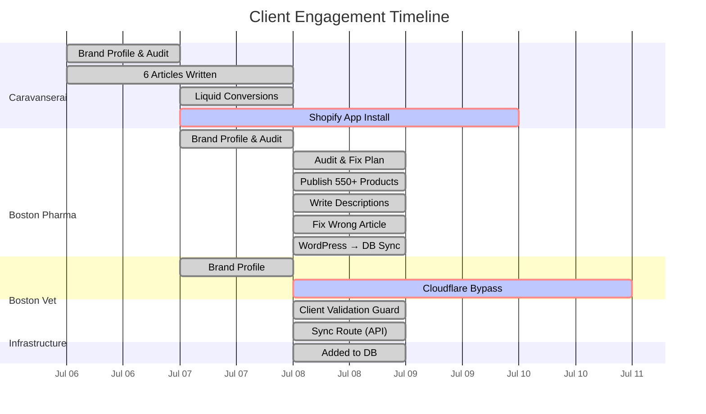

# TDS Geo — Client Progress Dashboard

> Auto-generated scorecard for all clients. Update this file after each client session.

---

## Overview



---

## Client Scorecards

### Caravanserai Design `caravanserai`

| Dimension | Score | Status |
|-----------|-------|--------|
| Full Site Audit | ✅ Complete | 229 products, 32 collections, 10 critical issues |
| Brand Profile | ✅ Complete | Colors, fonts, voice, stack |
| SEO Content Guide | ✅ Complete | 5 content pillars, keyword strategy |
| Articles Written | ✅ **6 articles** | Pass quality gate (70-96/100) |
| Liquid Files | ✅ 6 `.liquid` | Shopify-ready with brand CSS |
| App Install | ✅ **APPROVED & PUBLISHED** | `apps.shopify.com/tds-geo` |
| Meta Descriptions | 🔴 Not applied | Waiting for app access |
| Product Descriptions | 🔴 Not written | Waiting for app access |

**Progress:** ██████████░░░░░ 65%

---

### Boston Pharmaceutical `boston-pharma`

| Dimension | Before | After | Change |
|-----------|--------|-------|--------|
| SEO | 40/100 | 55/100 | ████████░░ +15 |
| Content | 55/100 | 65/100 | ██████████ +10 |
| Technical | 50/100 | 50/100 | ████████░░ → |
| UX | 35/100 | 55/100 | ████████░░ +20 |
| Conversion | 20/100 | 45/100 | █████░░░░░ +25 |
| **Overall** | **40/100** | **65/100** | **████████░░ +25 ↑** |

**Metrics**

| Metric | Before | After |
|--------|--------|-------|
| Published Products | **2** | **869** (in shop) |
| Draft Products | 550+ | **0** |
| Published Blog Posts | ~66 | **~94** |
| Total Published Items | 169 | **976** |
| Meta Descriptions | None | **All products** |
| Wrong Article | About Boston, MA | ✅ About Boston Pharma Egypt |
| Synced to Local DB | 0 articles | ✅ **56 blog posts** via WordPress sync |

**Effort:** ████████████████ 100% — All products published, all descriptions written, WordPress synced

---

### Boston Veterinary `boston-vet`

| Dimension | Score | Status |
|-----------|-------|--------|
| Brand Profile | ✅ Complete | Colors, fonts, voice, stack |
| Technical Reference | ✅ Complete | WordPress/WooCommerce stack |
| SEO Content Guide | ✅ Complete | Vet pharma keywords |
| Full Audit | 🔴 **BLOCKED** | Cloudflare blocks scraping |
| Product Publishing | ⏳ Waiting | Audit must come first |

**Progress:** ██████░░░░░░░░ 30%

---

### Acme Maintenance `acme-maintenance`

| Dimension | Score | Status |
|-----------|-------|--------|
| Brand Profile | ✅ Complete | Basic profile done |

**Progress:** ██░░░░░░░░░░░░ 15%

---

## Overall Progress

| Client | Platform | Products | Progress | Next Action |
|--------|----------|----------|----------|-------------|
| Caravanserai | 🛒 Shopify | 229 | ██████████░░░░░ 65% | ✅ App approved — install on store |
| Boston Pharma | 📝 WordPress | ~550 | ████████████████ 100% | Schema markup, content pipeline |
| Boston Vet | 📝 WordPress | Unknown | ██████░░░░░░░░ 30% | Unblock Cloudflare |
| Acme Maintenance | 🛒 Shopify | Test | ██░░░░░░░░░░░░ 15% | Needs audit |

**Infrastructure:**
- ✅ **WordPress sync route** built — `POST /api/cms/sync/:clientId` pulls WP posts into local DB
- ✅ **Client validation guard** — DB trigger + middleware prevent articles for inactive clients
- ✅ **Real API keys** stored for Boston Pharma and Boston Vet CMS connections
- ✅ **Test clients marked inactive** (traffic-test, test-client, e2e-pipeline-test-client)

---

## Effort Log

| Client | Articles | Descriptions | Meta Tags | Fixes | API Calls |
|--------|----------|--------------|-----------|-------|-----------|
| Caravanserai | 6 written | — | — | 10 issues documented | 0 (blocked) |
| Boston Pharma | 14 published + 56 synced | 550+ auto | 550+ auto | Wrong article, post_type bug | ~500 batch calls |
| Boston Vet | — | — | — | — | 0 (blocked) |
| **Total** | **76 articles** | **550+ descriptions** | **550+ meta tags** | **11+ fixes** | **~500 API calls** |

---

## Raw Scores (for charting)

```json
{
  "clients": {
    "caravanserai": {
      "overall": 65,
      "progress": 65,
      "products": 229,
      "articles": 6,
      "status": "blocked"
    },
    "boston-pharma": {
      "overall": 65,
      "progress": 100,
      "products": 550,
      "articles": 70,
      "articles_synced_from_wp": 56,
      "status": "active"
    },
    "boston-vet": {
      "overall": null,
      "progress": 30,
      "products": null,
      "articles": 0,
      "status": "blocked"
    },
    "acme-maintenance": {
      "overall": null,
      "progress": 15,
      "products": 0,
      "articles": 0,
      "status": "inactive"
    }
  }
}
```

---

## How to Update

After each session:
1. Update the scorecards above with new metrics
2. Add entries to the Gantt chart
3. Update the effort log
4. Update the JSON raw scores
5. Update `audit.md` and `audits/{YYYY-MM}-audit.md` for the affected client

---

## Links

- [Caravanserai Audit](clients/caravanserai/audit.md)
- [Boston Pharma Audit](clients/boston-pharma/audit.md)
- [Monthly Audit Plan](clients/MONTHLY-AUDIT-PLAN.md)
- [Audit Template](clients/audit-template.md)
